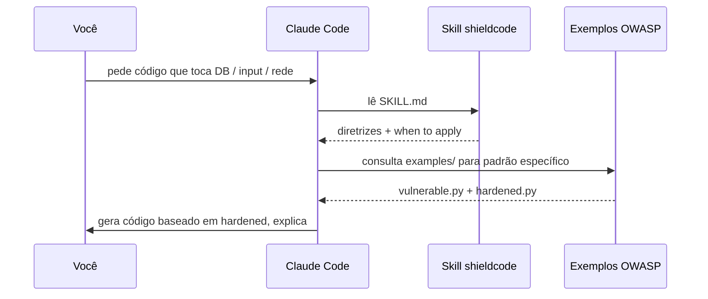

# Como a skill funciona

## Arquitetura

ShieldCode **NÃO** é:

- ❌ Um package npm / pip / gem
- ❌ Um MCP server
- ❌ Uma extensão de IDE

ShieldCode **É**:

- ✅ Um arquivo markdown (`SKILL.md`) que o Claude Code lê
- ✅ Diretrizes que o Claude segue ao gerar código
- ✅ Exemplos de pares "vulnerável vs seguro" pra cada cenário

## Por que skill em vez de package?

Padrões de segurança mudam conforme o framework, a linguagem, o contexto. Um package teria que cobrir 100 casos. Uma skill instrui o Claude a **raciocinar** sobre segurança, aplicando o padrão certo para o contexto.

## Fluxo



## Estrutura no repo

```
shieldcode/
├── skills/shieldcode/SKILL.md       # a skill em si
├── examples/
│   ├── sql-injection/
│   │   ├── vulnerable.py            # NÃO fazer
│   │   └── hardened.py              # jeito seguro
│   ├── xss/
│   ├── ssrf/
│   └── path-traversal/
├── install.sh
├── uninstall.sh
└── docs/                            # este site
```

## SKILL.md em alto nível

Contém regras como:

- "Ao gerar código que executa SQL, SEMPRE use parametrização. NUNCA concatene strings."
- "Ao receber input do usuário pra renderizar HTML, SEMPRE escape ou use auto-escape do template engine."
- "Ao construir caminhos de arquivo, SEMPRE canonicalize com `Path.resolve()` e valide que está dentro do diretório esperado."
- "Para cada output, INCLUA breve explicação do porquê o padrão é necessário."

Cobertura completa em [skills/shieldcode/SKILL.md](https://github.com/nikolasdehor/shieldcode/blob/main/skills/shieldcode/SKILL.md).

## Por que isso funciona

LLMs treinam em código GitHub. GitHub tem MUITO código inseguro (tutoriais antigos, código de aprendizado). Sem skill, o Claude tende a reproduzir padrões inseguros.

Skill estabelece um **prior** que sobrepõe a tendência ruim, forçando o Claude a parar e pensar antes de gerar.

## Limitações

- **Cobertura**: 4 cenários OWASP hoje. Outros (auth, crypto, RCE) serão adicionados.
- **Línguas**: exemplos em Python/JS. Em outras linguagens, Claude generaliza mas pode pular detalhes.
- **Audit**: não substitui pentesting nem code review humano.

ShieldCode reduz o ruído inicial. Defense-in-depth ainda exige outras layers.
