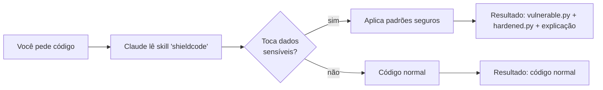

# ShieldCode

**Skill do Claude Code que protege código gerado contra OWASP Top 10.** SQL injection, XSS, SSRF, path traversal e mais.

[](https://github.com/nikolasdehor/shieldcode/blob/main/LICENSE)
[](https://docs.claude.com/en/docs/claude-code/skills)
[](https://owasp.org/Top10/)

## Por que ShieldCode

IA generativa é incrível pra prototipar rápido, mas tem um problema: **modelos de IA tendem a gerar código sem considerar segurança**. Estudo da Stanford mostrou que ~40% de código gerado por LLMs tem vulnerabilidades exploráveis.

ShieldCode é uma skill para Claude Code que **força o Claude a aplicar padrões seguros** ao gerar código que toca:

- Banco de dados (parametrize queries)
- Input do usuário (sanitização)
- Requisições externas (validação de URL)
- Sistema de arquivos (canonicalização de paths)
- Renderização HTML (escape automático)

## Como funciona

ShieldCode **NÃO é** um pacote npm/pip. É uma skill markdown que o Claude Code lê e aplica:



## Exemplo

```
Você: "faz um endpoint Flask que recebe nome de usuário e busca no DB"

Sem ShieldCode:
@app.route("/user/<username>")
def get_user(username):
    cursor.execute(f"SELECT * FROM users WHERE name='{username}'")  # SQL injection!

Com ShieldCode (Claude lê skill):
@app.route("/user/<username>")
def get_user(username):
    cursor.execute("SELECT * FROM users WHERE name = %s", (username,))  # parametrizado
    # + explicação no chat sobre por que essa forma é segura
```

## Vulnerabilidades cobertas

| Vulnerabilidade | OWASP | Exemplo no repo |
|----------------|-------|-----------------|
| [SQL Injection](vulns/sql-injection.md) | A03 | `examples/sql-injection/` |
| [XSS](vulns/xss.md) | A03 | `examples/xss/` |
| [SSRF](vulns/ssrf.md) | A10 | `examples/ssrf/` |
| [Path Traversal](vulns/path-traversal.md) | A01 | `examples/path-traversal/` |

## Quick start

```bash
git clone https://github.com/nikolasdehor/shieldcode
cd shieldcode
./install.sh --scope=user
```

Em qualquer projeto, peça ao Claude:

> "Use a skill shieldcode quando escrever código que toca DB, input ou rede"

## Onde ir agora

[:material-rocket: Instalação](getting-started/install.md){ .md-button .md-button--primary }
[:material-shield: Vulnerabilidades cobertas](vulns/sql-injection.md){ .md-button }
[:material-github: GitHub](https://github.com/nikolasdehor/shieldcode){ .md-button }
